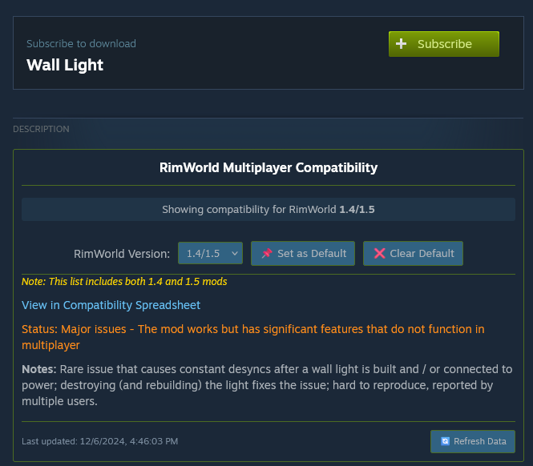
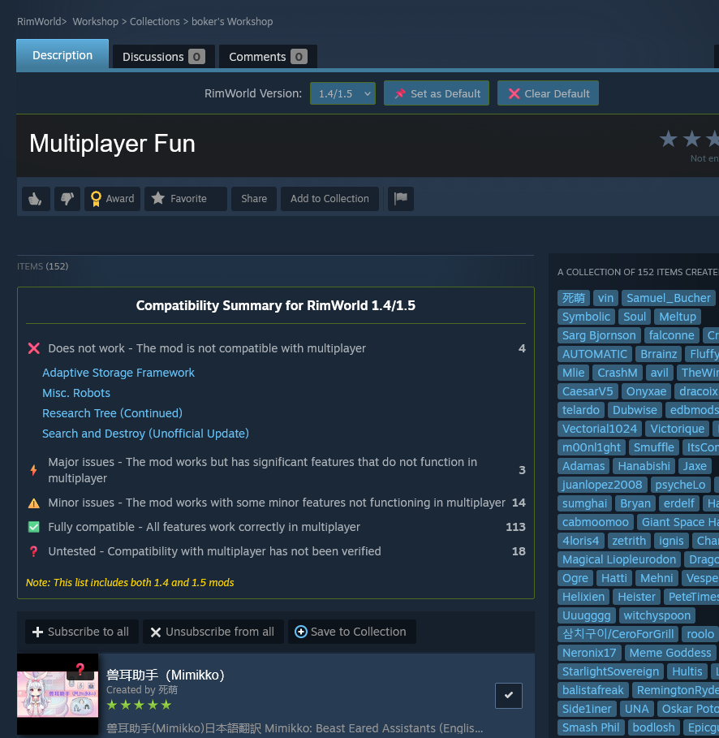
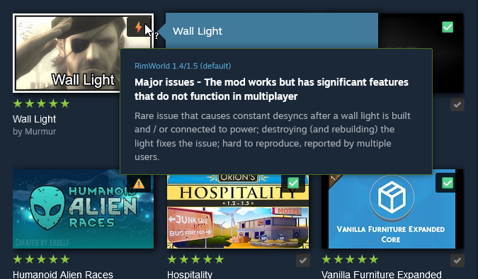
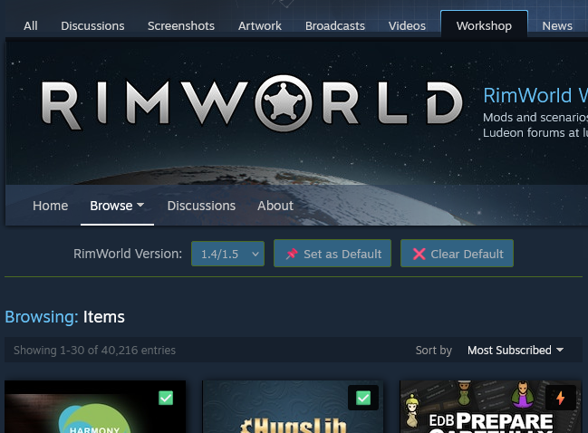

# RimWorld Multiplayer Compatibility Checker

A userscript that adds multiplayer compatibility information directly to Steam Workshop mod pages for RimWorld. The script integrates compatibility data from the [RimWorld Multiplayer Compatibility List](https://docs.google.com/spreadsheets/d/1jaDxV8F7bcz4E9zeIRmZGKuaX7d0kvWWq28aKckISaY) across all Steam Workshop pages for RimWorld.

## Showcase

  <table>
    <tr>
      <td align="center">
         
        <b>Individual Mod Page</b>
      </td>
      <td align="center">
         
        <b>Collections Summary</b>
      </td>
    </tr>
    <tr>
      <td align="center">
         
        <b>Workshop Browsing</b>
      </td>
      <td align="center">
         
        <b>Version Control</b>
      </td>
    </tr>
  </table>

## Features

### Comprehensive Integration
- Displays compatibility status across all Steam Workshop pages:
    - Individual mod pages
    - Collection pages
    - Workshop browsing pages
- Quick-view compatibility icons on mod thumbnails
- Detailed tooltips showing compatibility information
- Collection summaries showing compatibility breakdown

### Version Management
- Global version selector for checking different RimWorld versions
- Persistent default version setting
- Version-specific compatibility checking
- Easy version switching with immediate updates

### Detailed Information
- Compatibility status levels with clear indicators
- Detailed notes about specific compatibility issues
- Links to the compatibility spreadsheet for each mod
- Last update timestamp for compatibility data

### Technical Features
- Local data caching (24-hour refresh cycle)
- Automatic compatibility updates
- Responsive design that works across all workshop pages
- Clean integration with Steam's interface

## Installation

1. Install a userscript manager:
    - [Violentmonkey](https://violentmonkey.github.io/) (Recommended)
    - [Tampermonkey](https://www.tampermonkey.net/)
    - [Greasemonkey](https://www.greasespot.net/)

2. Click the badge below to install the script directly:

   

3. Alternatively, you can open the raw script file from GitHub. Your userscript manager should prompt you to install it.

## Usage

### Version Control
- Use the version selector bar at the top of workshop pages
- Set a default version with the 📌 button
- Clear default version with the ❌ button
- Version selection persists across workshop pages

### Collection Features
- View compatibility summary for all mods in a collection
- Expandable categories showing mod lists by compatibility
- Quick access to individual mod pages
- Automatic updates when changing versions

### Workshop Browsing
- Instant compatibility status via icons
- Hover tooltips with detailed information
- Version selector available while browsing
- Works with infinite scroll

### Compatibility Status Levels
- ✅ Fully Compatible - All features work correctly in multiplayer
- ⚠️ Minor Issues - Works with some minor features not functioning
- ⚡ Major Issues - Works but has significant features that don't function
- ❌ Does Not Work - Not compatible with multiplayer
- ❓ Untested - Compatibility has not been verified

## Data Source

This script uses data from the [RimWorld Multiplayer Compatibility List](https://docs.google.com/spreadsheets/d/1jaDxV8F7bcz4E9zeIRmZGKuaX7d0kvWWq28aKckISaY), which is actively maintained by the RimWorld multiplayer community.

## Contributing

Feel free to submit issues or pull requests if you find any bugs or have suggestions for improvements.

## License

This project is licensed under the GNU General Public License v3.0 - see the [LICENSE](LICENSE) file for details.

## Acknowledgments

- Thanks to the RimWorld multiplayer community for maintaining the [compatibility spreadsheet](https://docs.google.com/spreadsheets/d/1jaDxV8F7bcz4E9zeIRmZGKuaX7d0kvWWq28aKckISaY)
- Thanks to the creators and maintainers of the [RimWorld multiplayer mod](https://steamcommunity.com/sharedfiles/filedetails/?id=2606448745)

## Privacy

This script:
- Only runs on Steam Workshop pages for RimWorld
- Only accesses the public compatibility spreadsheet
- Stores cached data locally in your browser
- Does not collect or transmit any personal information

## Known Issues

- Some mods might show as "Untested" if they're not yet in the compatibility database
- Version selection may take a moment to update on collection pages with many mods